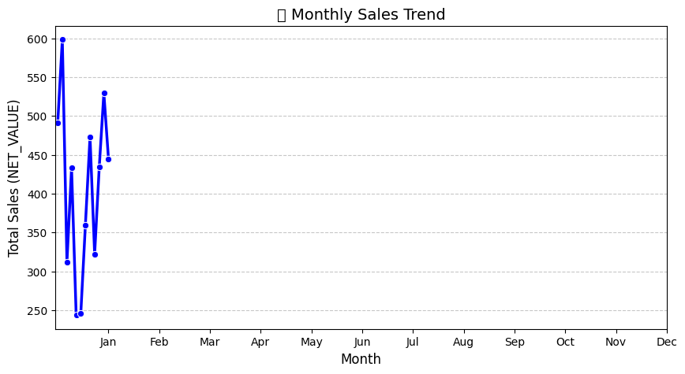
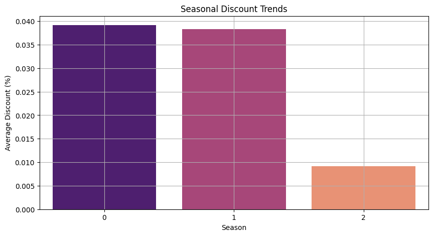

# 📊 Shoe Sales Forecasting & Inventory Optimization  

## 📌 Project Overview  
This project focuses on **sales forecasting and inventory optimization** using **Data Science techniques**.  
A **real dataset** from a **local shoe store in Jaipur (2015-2020)** was used, making this analysis unique and valuable.  
By predicting sales trends, the project provides actionable insights for **stock management, pricing strategies, and demand forecasting**.  

---

## 🚀 Objectives  
- Predict **future sales revenue (NET_VALUE)** using **Random Forest Regression**.  
- Optimize inventory by identifying high/low-demand items.  
- Analyze the impact of **discounts and seasonal trends** on sales.  
- Provide data-driven insights for stock and pricing adjustments.  

---

## 🛠️ Tech Stack  
- **Programming Language:** Python
- **Technologies Used:** Data Science, Deep Learning, Machine Learning, EDA
- **Libraries Used:** Pandas, NumPy, TensorFLow, NLTK, Scikit-learn, Matplotlib, Seaborn  

---

## 📂 Dataset Details  
The dataset includes **shoe sales records** from a Jaipur-based store, covering **5 years (2015-2020)**.  

### **Key Features:**  
- **YEAR, MONTH, DATE** → Time-based data for seasonal analysis  
- **ITEM, BRAND, ARTICLE_NAME** → Product details  
- **COLOUR, SIZE, ITEM_TYPE, LEATHER_TYPE, SEASON** → Product attributes  
- **QTY, GROSS_VALUE, DISCOUNT (%), NET_VALUE** → Sales performance metrics  

---

## 📈 Methodology  
1️⃣ **Data Preprocessing**  
   - Handling missing values, encoding categorical features, and scaling numerical values.  

2️⃣ **Feature Selection & Model Training**  
   - **Random Forest Regression** was chosen for its high accuracy and interpretability.  

3️⃣ **Evaluation & Optimization**  
   - **Acccuracy:** **83.80%** for NET_VALUE prediction.  
   - Hyperparameter tuning improved model performance.  

4️⃣ **Visualization & Insights**  
   - **Correlation Matrix** → Identifies key factors affecting sales.  
   - **Seasonality Trends** → Sales behavior across months/seasons.  
   - **Brand-wise/Item-wise Sales** → Demand distribution.  
   - **Discount Effectiveness Analysis** → Impact of discounts on revenue.  
   - **Seasonal Pricing Adjustments** → Optimal pricing strategies.
   - **Others also mentioned while EDA**  

---

## 🔍 Key Findings  
✅ **Certain brands/items consistently drive higher revenue → Stock them in advance.**  
✅ **Seasonality plays a major role in sales trends → Adjust inventory accordingly.**  
✅ **Discounts improve short-term sales but may not always boost overall revenue.**
✅ **Features like ITEM TYPE do not drive sales particularly.**

---

## 📊 Visualizations  
  
*Figure 1: Monthly Sales Trends*  

  
*Figure 2: Discount Effectiveness*  

---

## 🏆 Conclusion  
- This project demonstrates how **machine learning & deep learning can enhance sales forecasting and inventory planning**.  
- The dataset, sourced from a **real Jaipur-based shoe store**, provides **authentic insights** into retail sales dynamics.  
- Future improvements may include **deep learning models (LSTM) for more accurate time-series predictions**.  

---

## 🤝 Connect  
If you found this project helpful, feel free to ⭐ the repository!  
For inquiries, reach out via GitHub or email.  
---

🔗 **[Project Repository](https://github.com/your-username/shoe-sales-forecasting)**  

